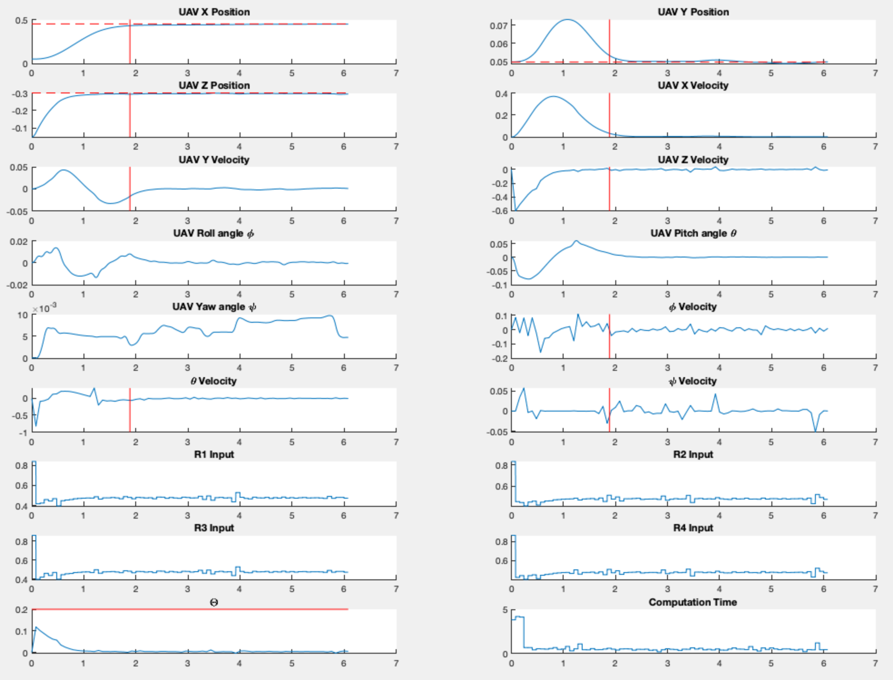
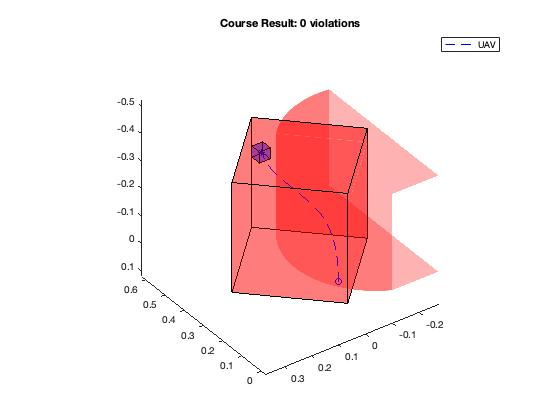
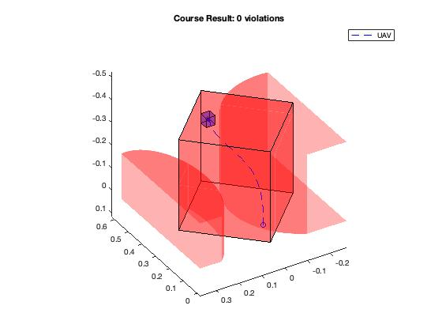
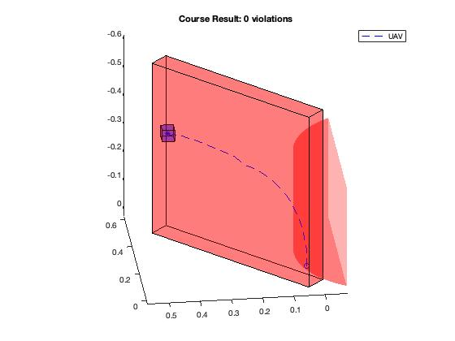
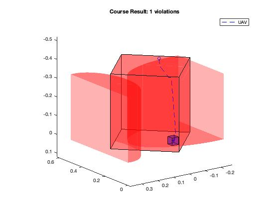

# NewbieMPC-Drone

> ❖ **Acknowledgements and Thanks**  
>  
> This project is made possible thanks to:
> - The Predictive Control (Fall 2025) coursework and guidance from Professor Eric Kerrigan  
> - The original UAV framework developed by Lucian Nita & Ian McInerney (Revision 2024.01)  
>
> All rights to the framework remain with the original authors.  

A simple quadrotor flight simulator featuring a nonlinear MPC controller based on quadrotor dynamics. Ideal for MPC beginners, it demonstrates trajectory optimization and obstacle avoidance by incorporating obstacle penalties directly into the cost function. The simulator supports various scenes with customizable obstacles and environments for flexible testing.

- The system model is 12-dimensional, encompassing position (x, y, z), orientation (φ, θ, ψ), linear velocities (u, v, w), and angular rates (p, q, r).
- Obstacles are modeled as elliptic cylinders in the environment.
- Controller improvements and customizations should be implemented in `myMPController.m` and `mySetup.m`.

---

## Simulation Results

### Dashboard (states, inputs, computation time)

The analysis script produces a dashboard of time-series plots: positions, velocities, attitudes, angular rates, the four motor inputs, and MPC computation time per step.



*Dashboard: UAV states, control inputs (R1–R4), and MPC computation time.*

---

### Course results (3D trajectory)

Examples of 3D trajectory plots with rectangular bounds and elliptical obstacles. The title shows the number of **constraint violations** (0 = success).

<table>
  <tr>
    <td>
      <br>
      <sub>
        <b>0 violations</b><br>
        UAV trajectory stays inside the constrained volume.<br>
        <i>(Cube = target area, Circle = start position)</i>
      </sub>
    </td>
    <td>
      <br>
      <sub>
        <b>0 violations</b><br>
        Path confined within the main volume and avoiding side zones.<br>
        <i>(Cube = target area, Circle = start position)</i>
      </sub>
    </td>
  </tr>
  <tr>
    <td>
      <br>
      <sub>
        <b>0 violations</b><br>
        UAV moves from the start position (circle) to the target area (cube), all within bounds.
      </sub>
    </td>
    <td>
      <br>
      <sub>
        <b>1 violation</b><br>
        Example with one constraint breach (for tuning or comparison).<br>
        <i>(Cube = target area, Circle = start position)</i>
      </sub>
    </td>
  </tr>
</table>


---

## Quick Start

### Requirements
- **MATLAB** (required)
- **Optimization Toolbox** (for `fmincon`)

### Setup

1. **Clone the repository:**
   ```bash
   git clone https://github.com/j2dog/NewbieMPC-Drone.git
   ```
2. **Open MATLAB** in the cloned folder.

### Running Simulations

Choose one of the main scripts to run:

- **Default single course:**  
  `testMyDesign_Nonlinear.m`

- **Multiple course shapes:**  
  `testMyDesign_Nonlinear_shapes.m`  
  *(Set `shapeNum` to 1, 2, 3, or 4 at the top of the script to select a scenario.)*

**What happens when you run a script?**

- Adds `Model/` and `HelperFunctions/` to your MATLAB path.
- Runs a 6-second nonlinear MPC quadrotor simulation.
- Plots the 3D trajectory.
- Opens a dashboard for state, control, and performance analysis.

---

## Project Structure

```
NewbieMPC-Drone/
├── testMyDesign_Nonlinear.m        # Main simulation (default course)
├── testMyDesign_Nonlinear_shapes.m # Simulation with 4 preset course shapes
├── defaultCourse.m                # Course generator (bounds, ellipses, start/target)
├── mySetup.m                      # MPC parameters (Ts, N, Q, R, P, constraints)
├── myMPController.m               # MPC controller (cost + constraints → fmincon → u)
├── Model/                         # UAV dynamics and parameters
│   ├── QuadrotorStateFcnBase.m    # 12-DOF state derivative (for prediction)
│   ├── UAV_NominalParameters.mat  # Nominal physical parameters
│   └── ...
├── HelperFunctions/               # Plotting and analysis
│   ├── plotCourse.m
│   ├── analyzeCourse.*            # Trajectory analysis and violation count
│   └── ...
└── assets/                        # Figures for documentation
```

- **State:** 12-DOF — position (x,y,z), orientation (φ,θ,ψ), linear velocity (u,v,w), angular velocity (p,q,r).  
- **Input:** 4-D — normalized motor commands in [0, 1].  
- **Controller:** `myMPController` uses nonlinear MPC with `QuadrotorStateFcnBase` for prediction, box + ellipse constraints, and `fmincon` to compute the control.


---

## Tuning the controller

- **`mySetup.m`:** Sampling time `Ts`, prediction horizon `N`, cost weights `Q`, `R`, `P`, and constraint geometry (rectangle, ellipses) passed to the controller.
- **`myMPController.m`:** Cost function (tracking + input penalty + optional soft constraints), nonlinear constraints (box + ellipses), and `fmincon` options.

Adjust these to improve tracking, constraint satisfaction, or computation time.

---


